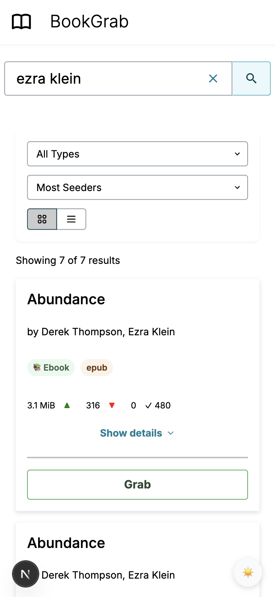

# BookGrab

> **Disclaimer:** BookGrab is a project i modified to suit my use. Support is limited to MyAnonaMouse (MAM) and qbittorrent.

BookGrab is a simple, streamlined web application that allows you to search for books on MyAnonaMouse using their RSS API and send downloads directly to your qBittorrent client. It provides a clean, straightforward interface for finding and downloading both ebooks and audiobooks.



## Why BookGrab?

Most people looking for book automation probably want [Readarr](https://readarr.com/). However, I built BookGrab because:

1. Readarr requires separate instances for audiobooks and ebooks, which is cumbersome
2. Readarr's author-based interface is too complicated to share with friends and family
3. I wanted a simpler, more direct search-and-download experience without the complexity of a full media management system

BookGrab focuses on doing one thing well: making it easy to search MAM and download books with a single click.

## Features

- Simple search interface for MyAnonaMouse's extensive book collection
- Display search results with book details (title, author, format, length for audiobooks)
- Download books directly to your qBittorrent client with a single click
- Separate download paths for audiobooks and ebooks (I send my audiobooks to the directory scanned by AudioBookshelf and the ebooks I send to the directory scanned by Calibre-Web)
- Light and dark mode support
- Minimal setup and configuration

## Getting Started

### Prerequisites

- A MyAnonaMouse account and session token
- A running qBittorrent client

### Installation Options

#### Option 1: Docker Compose (Recommended)

1. Create a `docker-compose.yml` file:

```yaml
version: '3'

services:
  bookgrab:
    image: mrorbitman/bookgrab:latest
    container_name: bookgrab
    ports:
      - "3000:3000"
    environment:
      - MAM_TOKEN=your_mam_token_here
      - TRANSMISSION_URL=http://your-transmission-server:9091/transmission/rpc
      - AUDIOBOOK_DESTINATION_PATH=/path/to/audiobooks
      - EBOOK_DESTINATION_PATH=/path/to/ebooks
    restart: unless-stopped
```

2. Update the environment variables with your own values
3. Run the container:

```bash
docker-compose up -d
```

4. Access BookGrab at http://localhost:3000

#### Option 2: Docker

Run the container directly:

```bash
docker run -d \
  --name bookgrab \
  -p 3000:3000 \
  -e MAM_TOKEN=your_mam_token_here \
  -e TRANSMISSION_URL=http://your-transmission-server:9091/transmission/rpc \
  -e AUDIOBOOK_DESTINATION_PATH=/path/to/audiobooks \
  -e EBOOK_DESTINATION_PATH=/path/to/ebooks \
  mrorbitman/bookgrab:latest
```

#### Option 3: Manual Installation

1. Prerequisites:
   - Node.js 18+ and npm

2. Clone the repository
3. Install dependencies:

```bash
npm install
```

4. Create a `.env.local` file in the root directory with the following variables:

```
MAM_TOKEN=your_mam_token_here
TRANSMISSION_URL=http://your-transmission-server:9091/transmission/rpc
AUDIOBOOK_DESTINATION_PATH=/path/to/audiobooks
EBOOK_DESTINATION_PATH=/path/to/ebooks
```

5. Run the development server:

```bash
npm run dev
```

6. Open [http://localhost:3000](http://localhost:3000) with your browser to see the application.

### Building for Production

If you're installing manually, you can build for production:

```bash
npm run build
npm start
```

## Technologies Used

- Next.js
- TypeScript
- AWS Amplify UI
- MyAnonyMouse RSS API
- Transmission RPC API

## Limitations

- Only works with MyAnonyMouse as the content source
- Requires a Transmission client for downloads
- No library management features - just search and download
- No automatic organization of downloaded content beyond basic path separation
